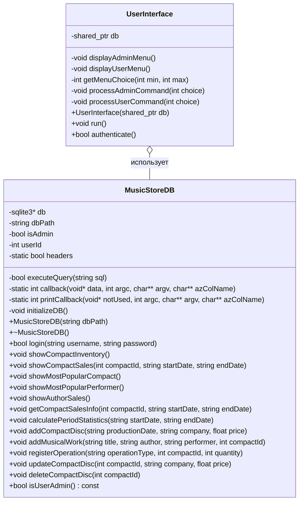
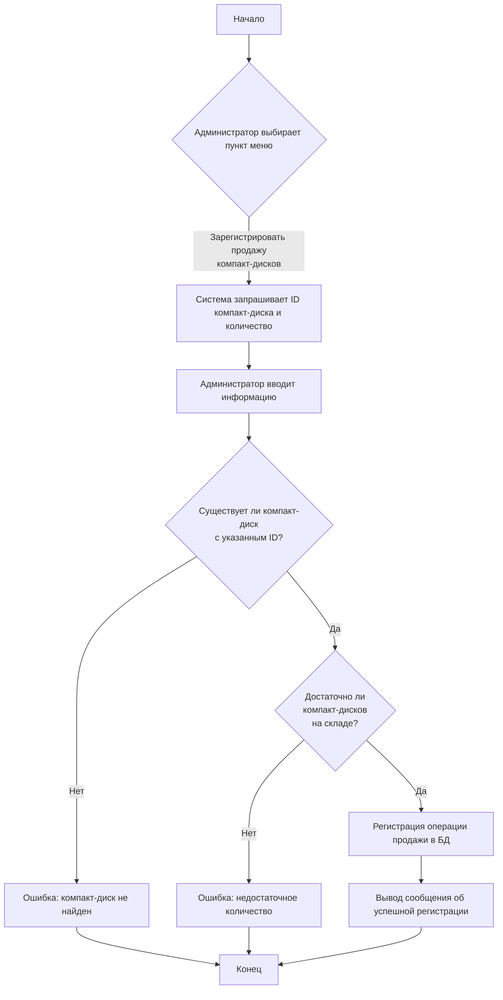
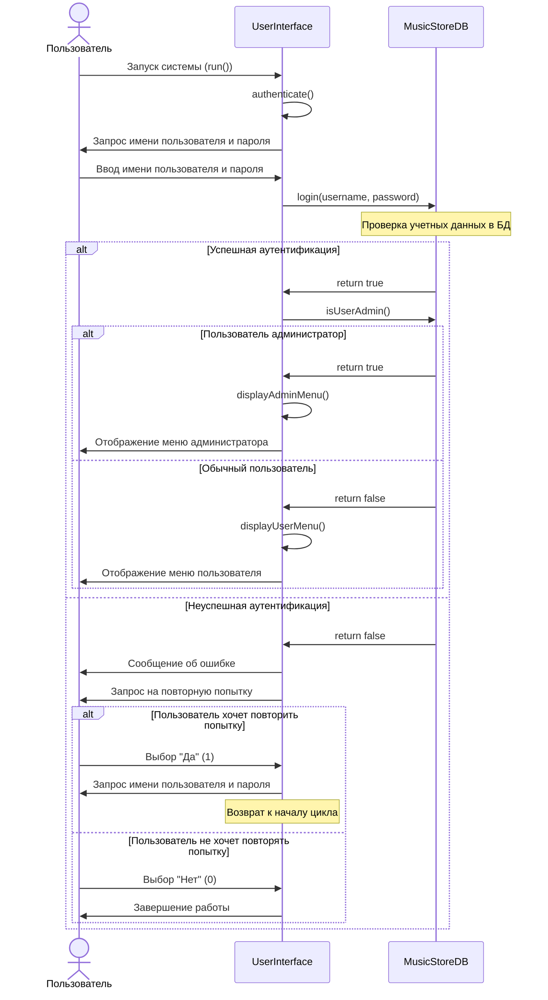
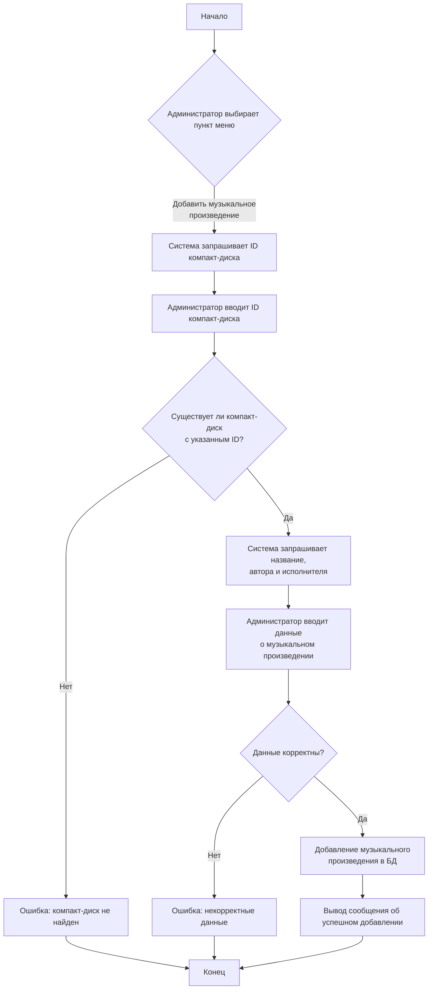
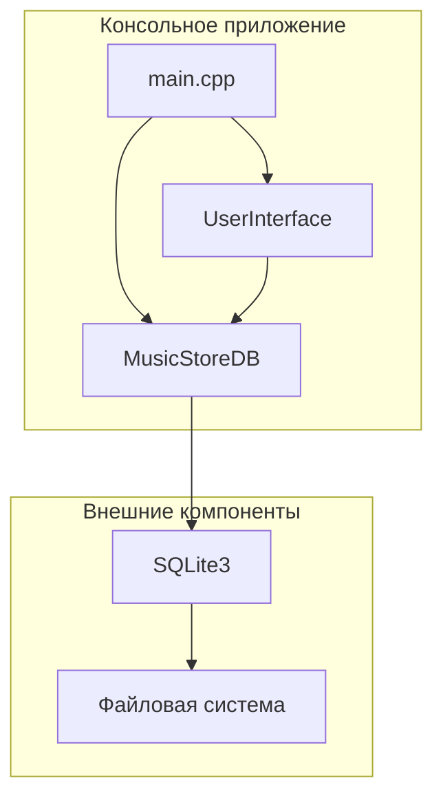
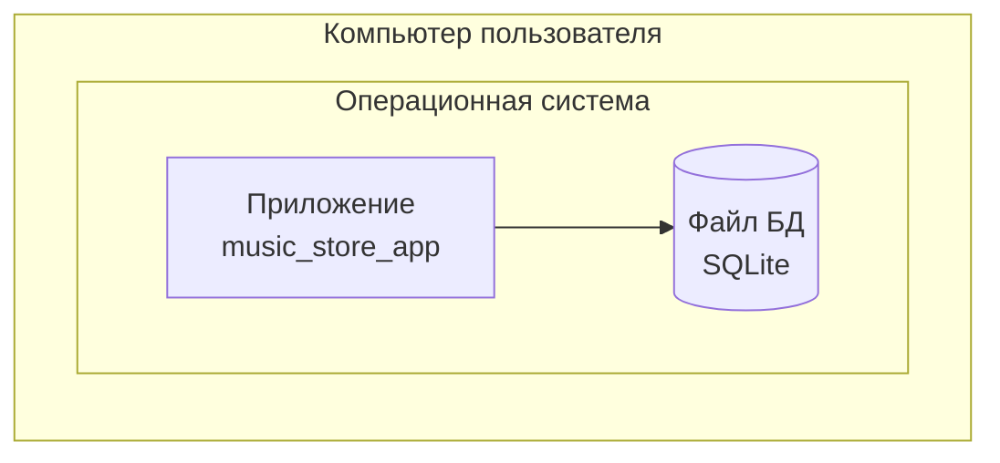
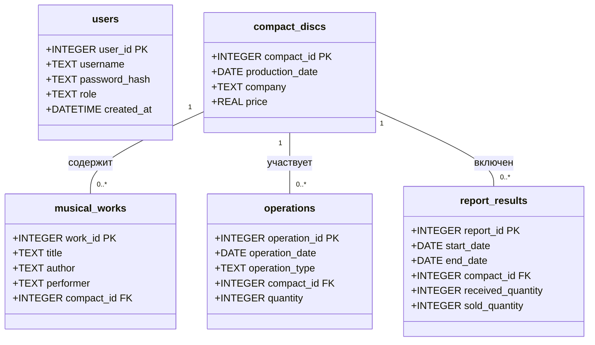

# Спецификация проекта

В данном разделе представлены UML-диаграммы, детализирующие структуру проекта "Музыкальный салон", разработанные на основе анализа исходного кода.

## Диаграмма классов

Диаграмма классов отображает основные классы проекта и их взаимосвязь. В системе есть два основных класса:
- `MusicStoreDB` - отвечает за работу с базой данных, содержит методы для выполнения запросов и бизнес-логику приложения
- `UserInterface` - отвечает за взаимодействие с пользователем, содержит методы для отображения меню и обработки пользовательских команд

Между классами существует композиционная связь, где `UserInterface` содержит указатель на `MusicStoreDB` и использует его для выполнения операций с базой данных.

## Диаграмма деятельности для процесса регистрации продажи компакт-дисков

Диаграмма деятельности показывает процесс регистрации продажи компакт-дисков администратором. Процесс включает проверку существования компакт-диска и наличия достаточного количества экземпляров на складе. Для проверки достаточного количества в базе данных используется триггер `check_sale_quantity`, который предотвращает продажу большего количества компакт-дисков, чем имеется в наличии.

## Диаграмма последовательности для процесса аутентификации и выбора меню

Диаграмма последовательности детально показывает процесс аутентификации пользователя и выбор соответствующего меню в зависимости от роли пользователя. Процесс включает обработку неуспешных попыток входа и предоставление пользователю возможности повторить попытку или завершить работу.

## Диаграмма деятельности для процесса добавления музыкального произведения

## Диаграмма компонентов

Диаграмма компонентов показывает структуру приложения и взаимосвязи между его компонентами. Система состоит из трех основных компонентов:
1. `main.cpp` - точка входа, отвечающая за инициализацию системы
2. `UserInterface` - компонент, реализующий взаимодействие с пользователем через консольный интерфейс
3. `MusicStoreDB` - компонент, реализующий доступ к данным и бизнес-логику приложения

Компонент `MusicStoreDB` взаимодействует с внешней библиотекой SQLite для хранения данных в файле базы данных.

## Диаграмма развертывания

Диаграмма развертывания показывает, как система развертывается на физической инфраструктуре. Система развертывается на одном компьютере и состоит из исполняемого файла `music_store_app` и файла базы данных SQLite. Оба компонента размещаются в операционной системе пользователя.

## Диаграмма классов базы данных

Диаграмма классов базы данных отображает структуру таблиц в базе данных и взаимосвязи между ними. База данных содержит пять основных таблиц:
1. `users` - хранение информации о пользователях системы
2. `compact_discs` - хранение информации о компакт-дисках
3. `musical_works` - хранение информации о музыкальных произведениях
4. `operations` - хранение информации об операциях поступления и продажи
5. `report_results` - хранение результатов статистических отчетов

Таблицы связаны между собой по ключевым полям, что обеспечивает целостность данных и возможность выполнения сложных запросов.
