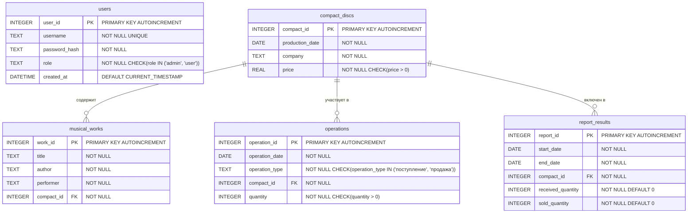

# Схема базы данных

## Диаграмма базы данных



## Описание таблиц

### Таблица `users`
Хранит информацию о пользователях системы.
- `user_id` - уникальный идентификатор пользователя
- `username` - имя пользователя (логин)
- `password_hash` - хеш пароля пользователя
- `role` - роль пользователя (admin или user)
- `created_at` - дата и время создания пользователя

### Таблица `compact_discs`
Хранит информацию о компакт-дисках.
- `compact_id` - уникальный идентификатор компакт-диска
- `production_date` - дата производства
- `company` - компания-производитель
- `price` - цена компакт-диска

### Таблица `musical_works`
Хранит информацию о музыкальных произведениях.
- `work_id` - уникальный идентификатор произведения
- `title` - название произведения
- `author` - автор произведения
- `performer` - исполнитель произведения
- `compact_id` - идентификатор компакт-диска, на котором находится произведение

### Таблица `operations`
Хранит информацию об операциях поступления и продажи компакт-дисков.
- `operation_id` - уникальный идентификатор операции
- `operation_date` - дата операции
- `operation_type` - тип операции (поступление или продажа)
- `compact_id` - идентификатор компакт-диска
- `quantity` - количество компакт-дисков в операции

### Таблица `report_results`
Хранит результаты расчета статистики за определенный период.
- `report_id` - уникальный идентификатор отчета
- `start_date` - начальная дата периода
- `end_date` - конечная дата периода
- `compact_id` - идентификатор компакт-диска
- `received_quantity` - количество поступивших компакт-дисков за период
- `sold_quantity` - количество проданных компакт-дисков за период

## Индексы

Для оптимизации запросов в базе данных созданы следующие индексы:

1. `idx_musical_works_compact_id` - индекс на поле `compact_id` в таблице `musical_works`
2. `idx_operations_compact_id` - индекс на поле `compact_id` в таблице `operations`
3. `idx_operations_type` - индекс на поле `operation_type` в таблице `operations`
4. `idx_operations_date` - индекс на поле `operation_date` в таблице `operations`
5. `idx_report_results_dates` - индекс на полях `start_date`, `end_date` в таблице `report_results`
6. `idx_report_results_compact_id` - индекс на поле `compact_id` в таблице `report_results`

## Триггеры

### Триггер `check_sale_quantity`
Этот триггер срабатывает перед вставкой новой записи в таблицу `operations` с типом "продажа". Он проверяет, что количество продаваемых компакт-дисков не превышает доступное количество (разницу между поступлениями и уже совершенными продажами).

```sql
CREATE TRIGGER check_sale_quantity 
BEFORE INSERT ON operations 
WHEN NEW.operation_type = 'продажа' 
BEGIN 
    SELECT 
        CASE 
            WHEN ( 
                SELECT COALESCE(SUM(quantity), 0) 
                FROM operations 
                WHERE compact_id = NEW.compact_id AND operation_type = 'поступление' 
            ) - ( 
                SELECT COALESCE(SUM(quantity), 0) 
                FROM operations 
                WHERE compact_id = NEW.compact_id AND operation_type = 'продажа' 
            ) < NEW.quantity 
            THEN RAISE(ABORT, 'Невозможно продать больше компактов, чем имеется в наличии') 
        END; 
END;
```
## Особенности реализации

1. **Каскадное удаление**: При удалении компакт-диска автоматически удаляются связанные с ним музыкальные произведения и записи в таблице `report_results`.

2. **Ограничение на удаление**: Нельзя удалить компакт-диск, если с ним связаны операции в таблице `operations`. Это сделано для сохранения целостности данных и истории операций.

3. **Автоматическая инициализация**: При первом запуске создаются стандартные учетные записи:
   - Администратор: логин `admin`, пароль `admin`
   - Пользователь: логин `user`, пароль `user`

4. **Проверка целостности данных**: Используются ограничения CHECK для проверки корректности данных (например, цена должна быть положительной, роль может быть только 'admin' или 'user').
