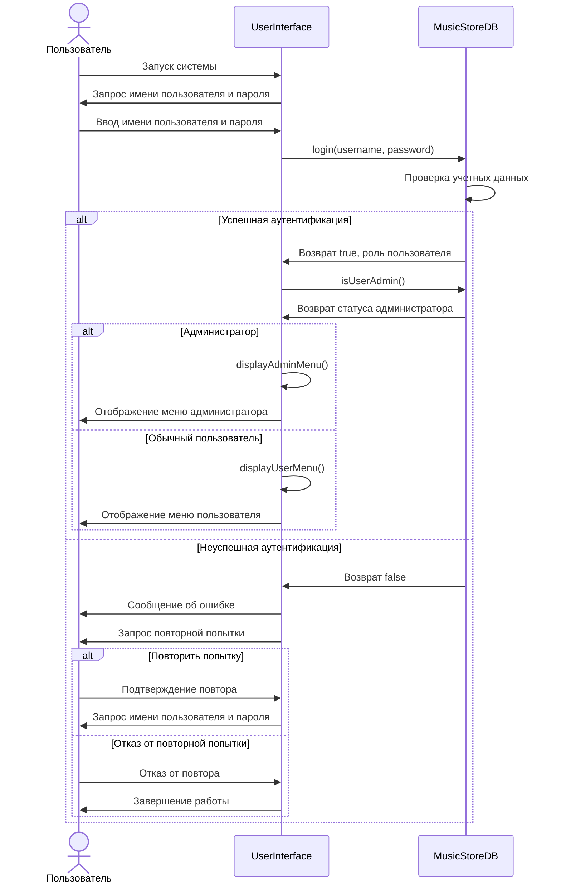

# Функциональные требования

## Общее описание

Система управления "Музыкальный салон" предназначена для автоматизации учёта компакт-дисков, музыкальных произведений и операций продаж в музыкальном салоне. Система должна обеспечивать хранение данных о компакт-дисках, музыкальных произведениях, операциях поступления и продажи, а также формирование различных статистических отчётов.

## Роли пользователей системы

В системе предусмотрены две роли пользователей:

1. **Администратор** - пользователь с полным доступом ко всем функциям системы
2. **Пользователь** - пользователь с ограниченным доступом к информационным функциям системы

## Диаграмма прецедентов (Use Case)

```mermaid
flowchart TB
  subgraph Users[Пользователи]
    Admin[Администратор]
    User[Пользователь]
  end
  
  subgraph System[Система Музыкальный салон]
    Auth[Аутентификация]
    ViewPopular[Просмотр самого популярного компакт-диска]
    ViewPopPerformer[Просмотр самого популярного исполнителя]
    ViewSales[Просмотр продаж компакт-диска]
    
    ViewAll[Просмотр всех компакт-дисков]
    ViewAuthorSales[Просмотр продаж по авторам]
    CalcStat[Расчёт статистики за период]
    AddCD[Добавление нового компакт-диска]
    AddMusic[Добавление музыкального произведения]
    RegReceipt[Регистрация поступления]
    RegSale[Регистрация продажи]
    UpdateCD[Обновление информации о компакт-диске]
    DeleteCD[Удаление компакт-диска]
  end
  
  User --> Auth
  User --> ViewPopular
  User --> ViewPopPerformer
  User --> ViewSales
  
  Admin --> Auth
  Admin --> ViewPopular
  Admin --> ViewPopPerformer
  Admin --> ViewSales
  Admin --> ViewAll
  Admin --> ViewAuthorSales
  Admin --> CalcStat
  Admin --> AddCD
  Admin --> AddMusic
  Admin --> RegReceipt
  Admin --> RegSale
  Admin --> UpdateCD
  Admin --> DeleteCD
```

## Детализация прецедентов

### UC-1: Аутентификация пользователя
**Актеры:** Администратор, Пользователь
**Предусловия:** Система запущена
**Постусловия:** Пользователь авторизован в системе с соответствующими правами

**Основной сценарий:**
1. Пользователь запускает систему
2. Система отображает форму входа
3. Пользователь вводит имя пользователя и пароль
4. Система проверяет введенные данные
5. Система определяет роль пользователя
6. Система отображает соответствующее меню для роли пользователя

**Альтернативные сценарии:**
- 4a. Введены неверные данные
  1. Система отображает сообщение об ошибке
  2. Система предлагает повторить ввод или выйти
  3. Возврат к шагу 3 или завершение работы

### UC-2: Добавление нового компакт-диска
**Актеры:** Администратор
**Предусловия:** Администратор авторизован в системе
**Постусловия:** В базу данных добавлен новый компакт-диск

**Основной сценарий:**
1. Администратор выбирает опцию "Добавить новый компакт-диск"
2. Система запрашивает информацию (дата производства, компания, цена)
3. Администратор вводит запрошенную информацию
4. Система валидирует введенные данные
5. Система сохраняет информацию о новом компакт-диске
6. Система отображает ID нового компакт-диска и сообщение об успехе

**Альтернативные сценарии:**
- 4a. Данные не прошли валидацию
  1. Система отображает сообщение об ошибке
  2. Система запрашивает ввод данных повторно
  3. Возврат к шагу 3

### UC-3: Регистрация поступления компакт-дисков
**Актеры:** Администратор
**Предусловия:** Администратор авторизован в системе, компакт-диск существует в базе
**Постусловия:** Зарегистрирована операция поступления компакт-дисков

**Основной сценарий:**
1. Администратор выбирает опцию "Зарегистрировать поступление компакт-дисков"
2. Система запрашивает ID компакт-диска и количество
3. Администратор вводит запрошенную информацию
4. Система валидирует введенные данные
5. Система регистрирует операцию поступления с текущей датой
6. Система отображает сообщение об успехе

**Альтернативные сценарии:**
- 4a. Компакт-диск с указанным ID не найден
  1. Система отображает сообщение об ошибке
  2. Система запрашивает ввод данных повторно
  3. Возврат к шагу 3

### UC-4: Регистрация продажи компакт-дисков
**Актеры:** Администратор
**Предусловия:** Администратор авторизован в системе, компакт-диск существует в базе, имеется достаточное количество компакт-дисков для продажи
**Постусловия:** Зарегистрирована операция продажи компакт-дисков

**Основной сценарий:**
1. Администратор выбирает опцию "Зарегистрировать продажу компакт-дисков"
2. Система запрашивает ID компакт-диска и количество
3. Администратор вводит запрошенную информацию
4. Система валидирует введенные данные и проверяет наличие достаточного количества дисков
5. Система регистрирует операцию продажи с текущей датой
6. Система отображает сообщение об успехе

**Альтернативные сценарии:**
- 4a. Недостаточное количество компакт-дисков для продажи
  1. Система отображает сообщение об ошибке
  2. Система запрашивает ввод данных повторно
  3. Возврат к шагу 3

### UC-5: Просмотр информации о самом популярном компакт-диске
**Актеры:** Администратор, Пользователь
**Предусловия:** Пользователь авторизован в системе
**Постусловия:** Отображена информация о самом популярном компакт-диске

**Основной сценарий:**
1. Пользователь выбирает опцию "Просмотреть информацию о самом популярном компакт-диске"
2. Система анализирует данные о продажах
3. Система определяет компакт-диск с наибольшим количеством продаж
4. Система отображает информацию о компакт-диске и список музыкальных произведений на нем

**Альтернативные сценарии:**
- 3a. Нет данных о продажах
  1. Система отображает сообщение об отсутствии данных о продажах

### UC-6: Расчет статистики за период
**Актеры:** Администратор
**Предусловия:** Администратор авторизован в системе
**Постусловия:** Рассчитана и отображена статистика за указанный период

**Основной сценарий:**
1. Администратор выбирает опцию "Рассчитать статистику за период"
2. Система запрашивает начальную и конечную даты периода
3. Администратор вводит запрошенные даты
4. Система валидирует введенные данные
5. Система рассчитывает статистику поступлений и продаж за указанный период
6. Система отображает сводную таблицу по всем компакт-дискам за указанный период

**Альтернативные сценарии:**
- 4a. Неверный формат дат или начальная дата больше конечной
  1. Система отображает сообщение об ошибке
  2. Система запрашивает ввод данных повторно
  3. Возврат к шагу 3

### UC-7: Добавление музыкального произведения
**Актеры:** Администратор
**Предусловия:** Администратор авторизован в системе, компакт-диск существует в базе
**Постусловия:** В базу данных добавлено новое музыкальное произведение

**Основной сценарий:**
1. Администратор выбирает опцию "Добавить музыкальное произведение"
2. Система запрашивает ID компакт-диска, название, автора и исполнителя произведения
3. Администратор вводит запрошенную информацию
4. Система валидирует введенные данные
5. Система сохраняет информацию о новом музыкальном произведении
6. Система отображает ID нового произведения и сообщение об успехе

**Альтернативные сценарии:**
- 4a. Компакт-диск с указанным ID не найден
  1. Система отображает сообщение об ошибке
  2. Система запрашивает ввод данных повторно
  3. Возврат к шагу 3

### UC-8: Просмотр информации о продажах по авторам
**Актеры:** Администратор
**Предусловия:** Администратор авторизован в системе
**Постусловия:** Отображена информация о продажах по авторам

**Основной сценарий:**
1. Администратор выбирает опцию "Просмотреть информацию о продажах по авторам"
2. Система анализирует данные о продажах
3. Система группирует данные по авторам произведений
4. Система отображает таблицу с информацией о продажах по каждому автору

**Альтернативные сценарии:**
- 3a. Нет данных о продажах
  1. Система отображает пустую таблицу или сообщение об отсутствии данных

## Диаграмма последовательности для процесса аутентификации

## Функциональные требования системы

1. **Управление пользователями**
   - Система должна обеспечивать аутентификацию пользователей
   - Система должна разграничивать права доступа для администраторов и обычных пользователей

2. **Управление компакт-дисками**
   - Система должна обеспечивать добавление новых компакт-дисков
   - Система должна обеспечивать обновление информации о существующих компакт-дисках
   - Система должна обеспечивать удаление компакт-дисков
   - Система должна контролировать, чтобы удаление компакт-дисков не нарушало целостность данных

3. **Управление музыкальными произведениями**
   - Система должна обеспечивать добавление новых музыкальных произведений
   - Система должна связывать музыкальные произведения с компакт-дисками

4. **Управление операциями**
   - Система должна обеспечивать регистрацию поступления компакт-дисков
   - Система должна обеспечивать регистрацию продажи компакт-дисков
   - Система должна контролировать, чтобы количество продаваемых компакт-дисков не превышало имеющееся в наличии

5. **Формирование отчетов и статистики**
   - Система должна отображать информацию о всех компакт-дисках
   - Система должна отображать информацию о продажах компакт-диска за период
   - Система должна определять самый популярный компакт-диск
   - Система должна определять самого популярного исполнителя
   - Система должна отображать информацию о продажах по авторам
   - Система должна рассчитывать статистику за указанный период

6. **Пользовательский интерфейс**
   - Система должна предоставлять консольный интерфейс для взаимодействия с пользователем
   - Система должна отображать разные меню в зависимости от роли пользователя
   - Система должна обеспечивать корректную обработку ввода пользователя